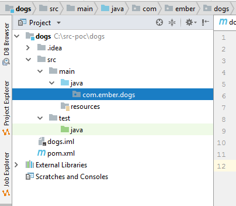

# Setup
We'll create a new maven project:

Enter information about your artifact (the code you are writing). If this was a public API other would use this when adding dependencies to your libraries. 

Enter the location on your hard-drive to create the project:

Confirm the creation of the project.

# New Package
Packages are a way to organize software in a logical way. There are two main types of them “org” and “com” for open source organizations and corporations. 
There are no rules about the package you use but I think com.ember is cool.

On the Project window, right-click on the java folder and select New – Package. Enter `com.ember.dogs`.

# New Class
Select the newly created package, righ-click and select **New – Class** to create the BarkingDog class.

Let’s create the `BarkingDog` class and the bark method. We’ll create a “fake” or “stub” method just to make sure things are properly configured. 
Use the following code:

    package com.ember.dogs;

    public class BarkingDog {

        public boolean bark(boolean barking, int hourOfDay) {
            return true;
        }
    }

# Build the Code (CTRL-F9)
Build the Project using the Build menu (CTRL-F9). It should be successful even if nothing happens. 

# Dependencies
When we started the project we selected maven. Maven is a tool that is used to manage dependencies on your code. In other words, if your code needs a library that somebody else wrote you need to include it in your project to use. We’ll start adding some dependencies we will need.

Double-click the `pom.xml` file to edit

## Add jUnit Dependencies
We'll add jUnit dependencies so that we can run test cases. Edit the `pom.xml` file to look as follows:

    <?xml version="1.0" encoding="UTF-8"?>
    <project xmlns="http://maven.apache.org/POM/4.0.0"
            xmlns:xsi="http://www.w3.org/2001/XMLSchema-instance"
            xsi:schemaLocation="http://maven.apache.org/POM/4.0.0 http://maven.apache.org/xsd/maven-4.0.0.xsd">
        <modelVersion>4.0.0</modelVersion>

        <groupId>com.ember</groupId>
        <artifactId>dogs</artifactId>
        <version>1.0-SNAPSHOT</version>

        <dependencies>
            <dependency>
                <groupId>junit</groupId>
                <artifactId>junit</artifactId>
                <version>4.12</version>
            </dependency>
        </dependencies>

    </project>

# Writing Test Code
Let’s try something slightly different. We’ll create tests for the code we are about to write. We’ll use the samples they provided. Select the `BarkingDog` class on the editor box and press CTRL-SHIFT-T. You should see a popup dialog that shows the option to create a new Test.

There are many tools we can use to write test code but we will use jUnit4. Enter the following settings:

After you click OK you will see a new class in the test folder that looks like the following:

    package com.ember.dogs;

    import org.junit.After;
    import org.junit.Before;
    import org.junit.Test;

    import static org.junit.Assert.*;

    public class BarkingDogTest {

        @Before
        public void setUp() throws Exception {
        }

        @After
        public void tearDown() throws Exception {
        }

        @Test
        public void bark() {
        }
    }

Each method that is annotated with a `@Test` indicates it is a test condition. We’ll create the conditions that were in the description of the problem. Enter the following code for the test class

    package com.ember.dogs;

    import org.junit.After;
    import org.junit.Before;
    import org.junit.Test;

    import static org.junit.Assert.*;

    public class BarkingDogTest {

        BarkingDog dog;

        @Before
        public void setUp() throws Exception {
            dog = new BarkingDog();
        }

        @After
        public void tearDown() throws Exception {
        }

        @Test
        public void testDogBarkingTooEarly() {
            boolean wakeUp = dog.bark(true, 1);
            assertTrue("Dog's barking too late, time to wake up", wakeUp);
        }

        @Test
        public void testDogIsNotBarkingTooEarly() {
            boolean wakeUp = dog.bark(false, 2);
            assertFalse("Dog is not barking. Keep sleeping", wakeUp);
        }

        @Test
        public void testDogBarksDuringTheDay() {
            boolean wakeUp = dog.bark(true, 8);
            assertFalse("Dog is not barking. No problem", wakeUp);
        }

        @Test
        public void testInvalidNegativeHour() {
            boolean wakeUp = dog.bark(true, -1);
            assertFalse("Dog is not barking. Not a valid hour", wakeUp);
        }

        @Test
        public void testInvalidPositiveHour() {
            boolean wakeUp = dog.bark(true, 24);
            assertFalse("Dog is not barking. Not a valid hour", wakeUp);
        }

    }

> Notice that we named our methods to indicate the test they are performing. There are assert calls to validate the result we expect. We'll learn about this later...

Run the test cases to verify that the code is NOT working yet (remember we have not written any code). Right-click on the test class and select Run `BarkingDogTest`. You can use `CTRL-SHIFT-F10` too. 

# Write the Barking Dog Code
Let's write now the functionality we were asked. 

We have a dog that likes to bark. We need to wake up If the dog is barking at night!

Write a method `bark` that has 2 parameters.

**1st parameter** should be of type Boolean and be named `barking` it represents if our dog is currently barking.

**2nd parameter** represents the hour of the day and is of type int with the name `hourOfDay` and has a valid range of 0-23.

We have to wake up if the dog is barking before 8:00am or after 22:00 hours so in that case return true.

In all other cases return false. If the hourOfDay parameter is less than 0 or greater than 23 return false.

Examples of input or output:

* Bark(true, 1); should return true.
* Bark(false, 2); should return false since the dog is not barking.
* Bark(true, 8); should return false, since it is not before 8am.
* Bark(true, -1); should return false because the hourOfDay parameter needs to be in range 0-23.

**TIP**: Use an if else statement with multiple conditions.
**NOTE**: The bark method needs to be defined as public static like we have been doing so far in this course.
**NOTE**: Do not add a main method to solution code.

> I didn’t read carefully the instructions but the first parameter indicates if the dog is barking already. The code should look like the following:

    package com.ember.dogs;

    public class BarkingDog {

        public boolean bark(boolean barking, int hourOfDay) {
            // Invalid hour
            if (hourOfDay < 0 || hourOfDay > 23) {
                return false;
            }

            // Dog's not barking
            if (!barking) {
                return false;
            }

            // If we reached here the dog is barking, check the hours
            if (hourOfDay < 8 || hourOfDay > 22) {
                return true;
            }
            else {
                return false;
            }
        }
    }

Run your test cases and you’ll verify it is working as expected: CTRL-SHIFT-F10

Happy Coding!
